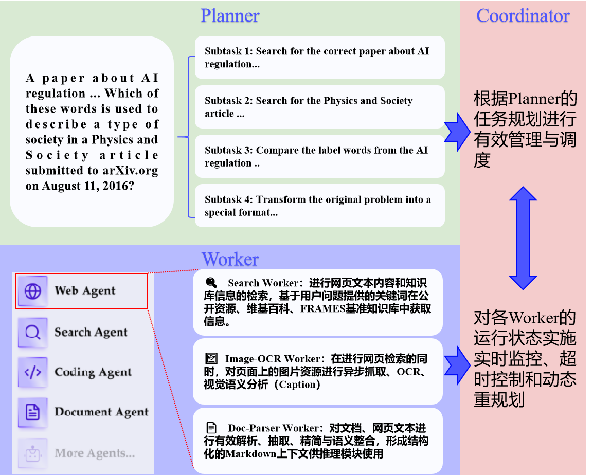

# 深度研究智能体系统（基于 OWL 与 DeepSeek-R1-0528）

本项目在 [OWL（Optimized Workforce Learning）](https://github.com/camel-ai/owl) 多智能体框架之上，集成了 DeepSeek-R1-0528 大语言模型，针对网页检索中遗失的图像信息进行了系统性增强。系统通过 Planner–Coordinator–Worker 三层架构，将用户提出的复杂研究型问题自动分解、检索、解析、OCR、推理与生成，最终输出高质量的答案。

## 模型亮点

- **多智能体解耦**：Planner（SFT+DPO 训练的 DeepSeek-R1-0528）负责高层任务分解，Coordinator 异步调度、超时与重规划，Worker 并发执行各类子任务。  
- **网页图像增强**：自研 `Image-OCR Worker`，从 HTML 源码中并发抓取所有图像，执行 OCR 与视觉描述（Caption），并将结果无缝注入文本上下文。  
- **多模态融合**：Doc-Parser、Search-Worker、Image-OCR-Worker 输出的结构化信息统一汇聚到 Reasoning-Worker，实现多步链式推理与准确答案生成。  
- **FRAMES 基准评测**：在 Google/FRAMES Benchmark 测试集上，系统整体准确率达到 **48.54%**。  
- **高效并发**：基于 `asyncio` 与 `aiohttp` 实现网页和图像异步抓取，所有 Worker 支持并行化处理；支持断点续跑与缓存去重。


## 环境与依赖

- **Python**：3.10+  
- **必需库**：
  
  ```bash
  pip install -r requirements.txt
  ```


## 快速开始

1. **克隆仓库**

   ```bash
   git clone https://github.com/KaiFengLikeWritingCode/myowl.git
   cd myowl
   ```

2. **配置环境变量**

   ```bash
   export DEEPSEEK_API_KEY="你的 DeepSeek API 密钥"
   set OPENAI_API_KEY="你的 DeepSeek API 密钥"
   
   ```

3. **安装依赖**

   ```bash
   # Change directory into project directory
   cd owl
   
   # Create a conda environment
   conda create -n owl python=3.10
   
   # Activate the conda environment
   conda activate owl
   pip install -r requirements.txt
   ```

4. **运行示例**

   ```bash
   python run_deepseek_zh.py # 使用deepseek单个单个的跑
   python run_mini.py # 使用openai单个单个的跑
   
   # 在运行run_mini.py时，需要配置google search api， 这个只能在调用openai模型时使用，申请链接https://coda.io/@jon-dallas/google-image-search-pack-example/search-engine-id-and-google-api-key-3
   # 需要获得ID和对应的key
   
   
   # 单线程
   python evaluate_frames.py --model deepseek-chat
   # 多线程评估，速度提高了30倍
   python evaluate_frames_mul.py --model deepseek-chat
   
   # 也可以使用DeepSeek-R1-0528进行评估，如果推理时也是用DeepSeek-R1-0528，要修改run_deepseek_zh.py中的model_type，将ModelType.DEEPSEEK_CHAT换成ModelType.DEEPSEEK_REASONER
   python evaluate_frames.py --model deepseek-reasoner
   python evaluate_frames_mul.py --model deepseek-reasoner
   ```

5. UI界面

   ```python
   # 注意运行时不要挂梯子
   python owl\webapp_zh.py
   ```

   

## 系统架构



1. **Planner**
   - 经过 SFT（监督微调）和 DPO（直接偏好优化）训练，能够将复杂问题拆分为有序子任务。
2. **Coordinator**
   - 基于 `asyncio` 事件循环，实现并发调度、超时控制和失败重试。
3. **Worker**
   - **Search Worker**：调用 Google/Wiki/自定义知识库 API，检索相关文本。
   - **Image-OCR Worker**：
     1. HTML 解析：BeautifulSoup + cssutils 提取所有图片 URL（包括 `img[srcset]`、CSS 背景）。
     2. 异步下载：`aiohttp` 并发抓取并缓存 (MD5 去重)。
     3. OCR：DeepSeek-Vision 提取图中文字；
     4. Caption：LLM 生成图像语义描述；
     5. 将结果以 `{{OCR: …}}` / `{{CAP: …}}` 插入 Markdown。
   - **Doc-Parser Worker**：对 PDF、Word、网页全文进行语义抽取，输出结构化 Markdown。
4. **Reasoning Worker**
   - 汇总各类证据，执行多段式推理链，生成符合要求的最终答案。

## 模块说明

- `agent_system/`
  - `planner.py`：任务分解与提示设计。
  - `coordinator.py`：异步调度与重规划逻辑。
  - `workers/`：包含 `search.py`、`image_ocr.py`、`doc_parser.py`、`reasoning.py`。
- `examples/`
  - `run_demo.py`：示例入口脚本。
- `tests/`
  - 各模块单元测试与集成测试。
- `requirements.txt` / `environment.yml`


## 贡献与协作

欢迎提出 Issue、Fork 本仓库并发送 Pull Request，或通过邮件 `dongkaizhi@stu.ouc.edu.cn` 联系维护者讨论技术细节。


## 参考文献

1. Hu M, Zhou Y, Fan W, et al. Owl: Optimized workforce learning for general multi-agent assistance in real-world task automation[J]. arXiv preprint arXiv:2505.23885, 2025.
2. Krishna S, Krishna K, Mohananey A, et al. Fact, fetch, and reason: A unified evaluation of retrieval-augmented generation[J]. arXiv preprint arXiv:2409.12941, 2024.
3. DeepSeek Inc. “DeepSeek-R1-0528 模型技术文档”, 2025.
4. Tesseract OCR: https://github.com/tesseract-ocr/tesseract
5. BeautifulSoup: https://www.crummy.com/software/BeautifulSoup/

